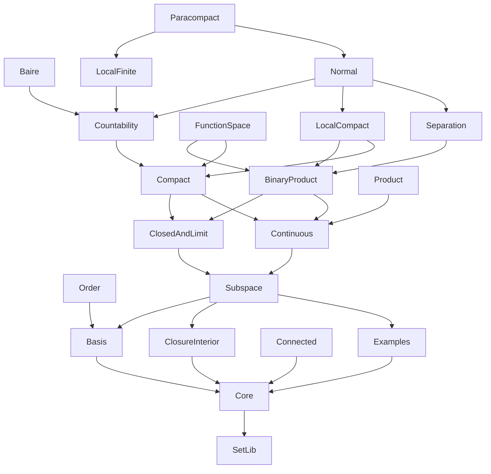

# MgwTopology Dependency Graph

Intra-project import DAG of the `MgwTopology` library. External
dependencies (Batteries, Lean core) are not shown. Click any node
to open its source file on GitHub.

The graph below is the **transitive reduction** of the raw import
graph (21 nodes, 78 direct imports → 29 non-redundant edges).
An edge `A --> B` means `A` imports `B` directly, and there is no
longer alternative path `A → … → B` through other modules.

## Modules (topological order)

- **[SetLib](https://github.com/ldct/mgw-topology/blob/main/MgwTopology/SetLib.lean)** (L0) — A minimal `Set α` library for the MgwTopology port.
- **[Core](https://github.com/ldct/mgw-topology/blob/main/MgwTopology/Core.lean)** (L1) — Core topology definitions.
- **[Basis](https://github.com/ldct/mgw-topology/blob/main/MgwTopology/Basis.lean)** (L2) — Bases and subbases for a topology.
- **[ClosureInterior](https://github.com/ldct/mgw-topology/blob/main/MgwTopology/ClosureInterior.lean)** (L2) — Closure, interior, and boundary operators.
- **[Connected](https://github.com/ldct/mgw-topology/blob/main/MgwTopology/Connected.lean)** (L2) — Connected spaces.
- **[Examples](https://github.com/ldct/mgw-topology/blob/main/MgwTopology/Examples.lean)** (L2) — Example topologies and the finer/coarser relation.
- **[Order](https://github.com/ldct/mgw-topology/blob/main/MgwTopology/Order.lean)** (L3) — The order topology.
- **[Subspace](https://github.com/ldct/mgw-topology/blob/main/MgwTopology/Subspace.lean)** (L3) — The subspace topology.
- **[ClosedAndLimit](https://github.com/ldct/mgw-topology/blob/main/MgwTopology/ClosedAndLimit.lean)** (L4) — Closed sets and limit points.
- **[Continuous](https://github.com/ldct/mgw-topology/blob/main/MgwTopology/Continuous.lean)** (L4) — Continuous maps.
- **[BinaryProduct](https://github.com/ldct/mgw-topology/blob/main/MgwTopology/BinaryProduct.lean)** (L5) — Binary product topology (X × Y).
- **[Compact](https://github.com/ldct/mgw-topology/blob/main/MgwTopology/Compact.lean)** (L5) — Compact spaces.
- **[Product](https://github.com/ldct/mgw-topology/blob/main/MgwTopology/Product.lean)** (L5) — Indexed product topology (finite index / box topology version).
- **[Countability](https://github.com/ldct/mgw-topology/blob/main/MgwTopology/Countability.lean)** (L6) — Countability axioms.
- **[FunctionSpace](https://github.com/ldct/mgw-topology/blob/main/MgwTopology/FunctionSpace.lean)** (L6) — Function spaces: pointwise and compact-open topologies.
- **[LocalCompact](https://github.com/ldct/mgw-topology/blob/main/MgwTopology/LocalCompact.lean)** (L6) — Locally compact spaces.
- **[Separation](https://github.com/ldct/mgw-topology/blob/main/MgwTopology/Separation.lean)** (L6) — Separation axioms: T1, Hausdorff, regular, normal.
- **[Baire](https://github.com/ldct/mgw-topology/blob/main/MgwTopology/Baire.lean)** (L7) — Baire spaces and G_δ / F_σ sets.
- **[LocalFinite](https://github.com/ldct/mgw-topology/blob/main/MgwTopology/LocalFinite.lean)** (L7) — Local finiteness.
- **[Normal](https://github.com/ldct/mgw-topology/blob/main/MgwTopology/Normal.lean)** (L7) — Normal spaces.
- **[Paracompact](https://github.com/ldct/mgw-topology/blob/main/MgwTopology/Paracompact.lean)** (L8) — Paracompactness.
